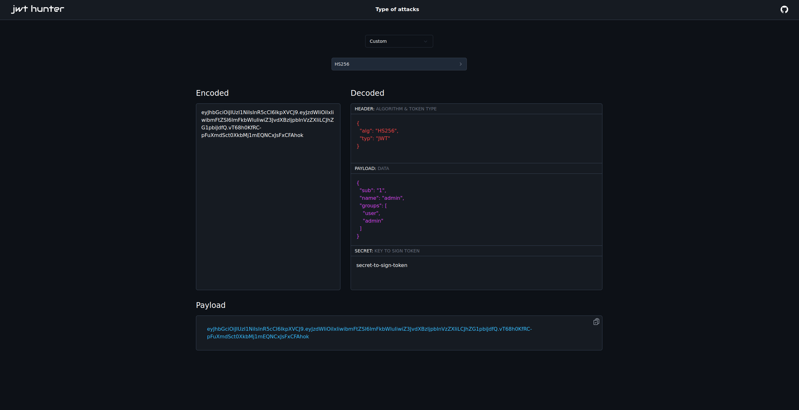

# JWT Hunter

A [simple tool](https://jwthunter.io) to exploit JWT vulnerabilities.

## Implemented attacks:
- [x] None algorithm attack
- [x] KID Header injection
- [x] Algorithm confusion

If you need to perform another attack, you can use the "custom" function to modify the fields you want and choose your own signing key.

# Preview

